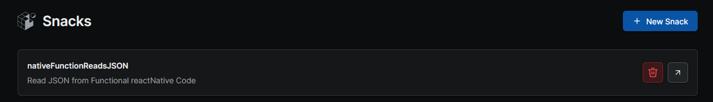
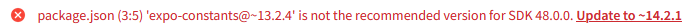
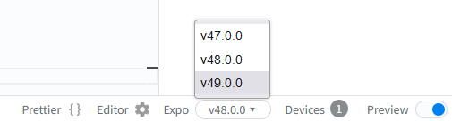
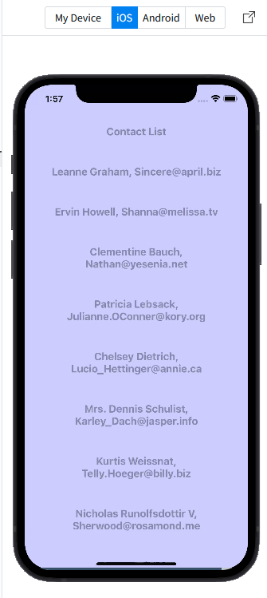
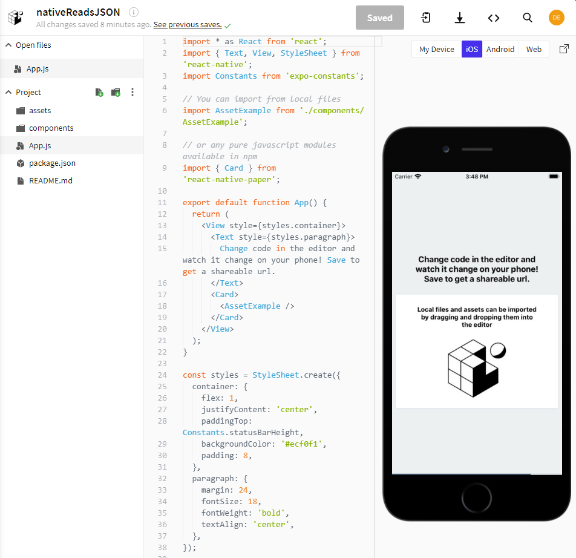
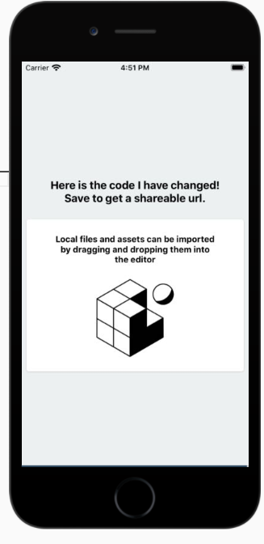
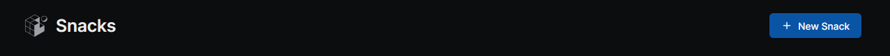

## Running native in EXPO

Expo provides features to support the development of react-native web apps.  Details of features can be followed in the [Expo blog](https://blog.expo.io/).  

[A recent blog entry](https://blog.expo.dev/expo-sdk-49-c6d398cdf740) says that EXPO SDK 49 is available and supports [react native 0.72.4](https://reactnative.dev/) and React 18.

As well as allowing you to develop react native for mobile applications, expo also allows you to develop react code for web apps and these are Progressive Web Apps by default and so installable across platforms.  A blog entry describes the c[reation and deployment of a progressive web app](https://blog.expo.io/create-and-deploy-web-apps-and-pwas-with-expo-a286cc35d83c)

Whilst the main route to developing apps might be the expo CLI, there is an online facility which should be the starting point for development called [Snack](https://blog.expo.io/sketch-a-playground-for-react-native-16b2401f44a2).  This should be the starting point for try out.

So I am going to make a snack starting with the reactReadsJSON code and seeking to translate this to React-Native.

I have made an expo account so can sign in at https://expo.dev/ 

I have a snack already made called nativeFunctionReads.JSON



On opening this I see a message which says it was written on an old version of expo and so it is updated.

I also see a message 



I can see all the files in the App so I can view package.json and see where the change is needed.

```javascript
{
  "dependencies": {
    "expo-constants": "~13.2.4",
    "react-native-paper": "4.9.2"
  }
}
```

Update this to read 

```javascript
{
  "dependencies": {
    "expo-constants": "~14.2.1",
    "react-native-paper": "3.6.0"
  }
}
```
My old snack is now ready to go. 

At the bottom right of the page I see that I am currently using Expo v48.0.0 so I will step this up to v49.



That pushes my package.json forward a bit further.

```javascript
{
  "dependencies": {
    "expo-constants": "~14.4.2",
    "react-native-paper": "4.9.2"
  }
}
```

The old app is written in Javascript with app.js using the fetch command to retrieve data from jsonplaceholder.typicode.com/user and components/Contacts.js printing trhe results neatly.  

**App.js**
```javascript
import { useState, useEffect } from 'react';
import Contacts from './components/Contacts';

function App() {
  const [contacts, setContacts] = useState([]);
  useEffect(() => {
    getContacts();
  }, []);

  const getContacts = () => {
    fetch('https://jsonplaceholder.typicode.com/users')
      .then((res) => res.json())
      .then(
        (data) => {
          console.log(data);
          setContacts(data);
        },
        (error) => {
          console.log(error);
          setContacts(null);
        }
      );
  };

  if (!contacts) return <div>No Record Found</div>;
  return <Contacts contacts={contacts} />;
}

export default App;
```

And in the folder components

**Contacts.js**
```javascript
 // src/components/contacts.js

import React from 'react';
import { Text, View, StyleSheet } from 'react-native';
import { ActivityIndicator, FlatList } from 'react-native';
import Constants from 'expo-constants';

const Contacts = ({ contacts, isLoading }) => {
   return (
     <View style={styles.container}>
        <Text style={styles.card} >Contact List</Text>
        {isLoading ? <ActivityIndicator/> : (
          <FlatList 
            data={contacts}
            keyExtractor={({ id }, index) => id}
            renderItem={({ item }) => (
              <Text style={styles.card}>{item.name}, {item.email}</Text>
            )}
          />
        )}
      </View>
   );
 }

 export default Contacts

 const styles = StyleSheet.create({
  container: {
    flex: 1,
    justifyContent: 'center',
    paddingTop: Constants.statusBarHeight,
    backgroundColor: '#ccccff',
    padding: 8,
  },
  card: {
    margin: 24,
    fontSize: 18,
    color: '#8888aa',
    fontWeight: 'bold',
    textAlign: 'center',
  },
});
```


I only have one device connected and that is firefox, and that allows me to see a web preview of the snack.

I can see a web preview of the app working.


I will save that now.

In order to view the app live on your phone go to the apple store or the play store and download the expo app to your phone.

When you first look you should see a starter app is set up ready.

You can see snacks on your phone and see them hot update as you edit them.

If you don't have a phone handy you can run a simulator online, however, there is a limitted pool of simulators so you may need to wait for a minute or so to get one.

You should see the queue count down.

Once I have an online simulator the code is shown.



If you are setting up a new account and lok for an ios simulation you will get a default starter app



Editing the code causes a live update.



## Porting from React

Much of the code from react will carry straight over into react native, but jsx representations of html tags  will need to be replaced by react-native  views and  widgets.

You should refer to the react-native page describing [Fetch.](https://reactnative.dev/docs/network#using-fetch).

The [basics of react as used within react native are also described] (https://reactnative.dev/docs/intro-react) for the class component.


The function based code to read JSON form and API also works in expo snack.  I notice that snack favours Capital letters on the file names so the import line needs to be adjusted.

Note also that the output from contacts does not use JSX but rather uses the react native View and widgets such as text.

The core components of ReactNative are listed [here](https://reactnative.dev/docs/view), you should compare these to bootstrap components such as card used before.

### Typescript version

Since the react version of JSON api reader was written in typescript it should be popssible to adapt this to a snack.

From the dashboard create a new snack



Rename the snack as typicodeGetTypescript


You are then invited to save the code and now have the code of the default starter project.

Copy across the old javascript code and we will adapt this.  Start by renaming App and Contacts with the .tsx extension instead of .js

There is a guide on [Typescript for React native](https://reactnative.dev/docs/typescript#getting-started-with-typescript).

This time I have used axios hooks within a component file to fetch the data following the advice in [Sreejit De's Blog](https://blog.sreejit.dev/custom-axios-hook-useaxios-in-typescript-react).

**components/UseAxios.ts**
```javascript
import { useState, useEffect } from 'react';
import axios, { AxiosError, AxiosRequestConfig, AxiosResponse } from 'axios';

axios.defaults.baseURL = 'https://jsonplaceholder.typicode.com';

const useAxios = (axiosParams: AxiosRequestConfig) => {
  const [response, setResponse] = useState<AxiosResponse>();
  const [error, setError] = useState<AxiosError>();
  const [loading, setLoading] = useState(true);

 const fetchData = async (params: AxiosRequestConfig) => {
    try {
      const result = await axios.request(params);
      setResponse(result);
    } catch( err ) {
      setError(err as AxiosError);
    } finally {
      setLoading(false);
    }
 };

useEffect(() => {
  fetchData(axiosParams);
},[axiosParams]);

 return { response, error, loading };
}

export default useAxios;
```

This is then presented in App.js using a Flatlist component.  There is an example of use of [flatlist in typescript](https://reactnative.dev/docs/flatlist).

**App.tsx**
```javascript
import useAxios from './components/UseAxios';
import { Text, View, StyleSheet } from 'react-native';
import { ActivityIndicator, FlatList } from 'react-native';
import Constants from 'expo-constants';


function App() {

interface Company{
  name:string
  catchPhrase:string;
  bs:string;
}

interface User {
  id: string;
  name: string;
  email: string;
  company:Company;
}

  const { response, loading, error } = useAxios({
    method: "GET",
    url: `/users`,
    headers: {
      accept: '*/*'
    }
  });
  const  myData:User[] = (response?.data);

  return (
    <View style={styles.container}>
      <Text style={styles.card} >Contact List</Text>
      {loading && (
        <Text>Loading...</Text>
      )}
      {error && (
        <Text>{error.message}</Text>
      )}
      {loading ? <ActivityIndicator/> : (
          
      <FlatList
            data = {myData}
            keyExtractor = {({ id }, index) => id}
            renderItem = {({ item }:{item:User}) => (
              <Text style={styles.card}>{item.name}{'\n'} 
                                        {item.email}{'\n'}  
                                        {item.company.name}{'\n'} 
                                        {item.company.catchPhrase}{'\n'} 
                                        {item.company.bs}
              </Text>
            )}
          />
        )}
 
    </View>
  );
}

export default App;

const styles = StyleSheet.create({
  container: {
    flex: 1,
    justifyContent: 'center',
    paddingTop: Constants.statusBarHeight,
    backgroundColor: '#ccccff',
    padding: 8,
  },
  card: {
    margin: 24,
    fontSize: 18,
    color: '#8888aa',
    fontWeight: 'bold',
    textAlign: 'center',
  },
});

```


