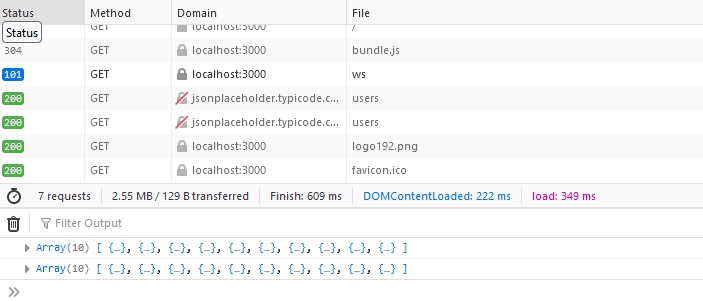
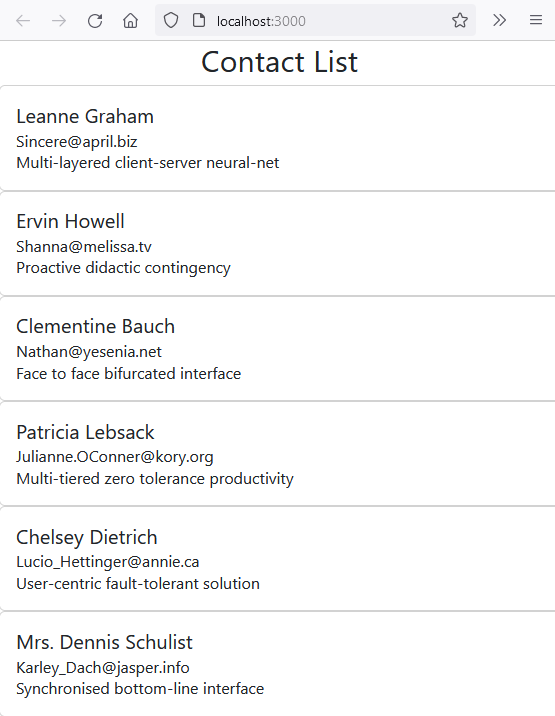

## Consume Json API with function

In this section we fetch information from a REST API and display the results fusing a functional approach.

## UseEffect

To make this work will require a look at a second react Hook useEffect

The function of a react component is to render a User Interface having updated state.  Other functions such as the fetching of data are regarded as side effects.  You need UseEffect to make a side effect work.

useEffect accepts two arguments, a function and a dependancy.  The dependancy is optional, however if it is omitted the UI might be rendered repeatedly.

An example of use can be seen at [W3Schools](https://www.w3schools.com/react/react_useeffect.asp)

```javascript
// see W3Schools https://www.w3schools.com/react/react_useeffect.asp
import { useState, useEffect } from "react";
import ReactDOM from "react-dom/client";

function Timer() {
  const [count, setCount] = useState(0);

  useEffect(() => {
    setTimeout(() => {
      setCount((count) => count + 1);
    }, 1000);
  }, []); // <- add empty brackets here

  return <h1>I've rendered {count} times!</h1>;
}

const root = ReactDOM.createRoot(document.getElementById('root'));
root.render(<Timer />);
```
This pattern can be applied to the current situation of fetching data.

## Consuming fetched data

Import the useState and useEffect modules from react.

```javascript
import {useState, useEffect} from 'react'
```

Express the component as a function.

```javascript
function App() {
```

Create a conns to hold the variable contacts and a method to update its state, setContacts.

```javascript
 const [contacts, setContacts] = useState([]);
```

Create a useEffect function which will allow an action to happen when the containing function is complete.

```javascript
useEffect(() => {getContacts();},[]);
```

Store an instance of the getContacts function as a const.  This will fetch the data using a promise.

```javascript
 const getContacts = () => {
    fetch('http://jsonplaceholder.typicode.com/users')
    .then(res => res.json())
    .then(
      (data) => {
        console.log (data );
        setContacts (data );
      },
      (error) => {
        console.log(error);
        setContacts(null);
      }
    );
  };
```

Passing back data to the console.log is simply a debugging step.  This shows that the array of 10 objects has beed fetched.



Clicking over one of the brackets reveals further detail.  This example is rendered in Firefox.


With some error checking pass the contacts as a prop to the Contacts module to display.

```javascript
 if (!contacts) return <div>No Record Found</div>;
  return (
    <Contacts contacts={contacts} />
  )
```

The full listing of **App.js** now becomes:


```javascript
import {useState, useEffect} from 'react'
import Contacts from './components/contacts';

function App() {

  const [contacts, setContacts] = useState([]);
  useEffect(() => {getContacts();},[]);

  const getContacts = () => {
    fetch('http://jsonplaceholder.typicode.com/users')
    .then(res => res.json())
    .then(
      (data) => {
        console.log (data );
        setContacts (data );
      },
      (error) => {
        console.log(error);
        setContacts(null);
      }
    );
  };

 if (!contacts) return <div>No Record Found</div>;
  return (
    <Contacts contacts={contacts} />
  )
 
}  

export default App;

```
>CTRL C 

to close the development server and reissue

> npm start 

to restart and recompile.



>CTRL C 

to close the development server and reissue

When you are finished, don't forget to commit your changes and synchronise so that the vital code will be stored on github.


## Consume Json API

The next step is to create a mock server using postman which will deliver JSON data similar to a subset of the http://jsonplaceholder.typicode.com/users dataset.

Then point the app at this endpoint to consume this.
Once that is done, you can design your own API for a proof-of-concept app into Postman.

### Reference

[Learn React Hooks](https://www.packtpub.com/product/learn-react-hooks/9781838641443)

[useEffect hooks W3Schools](https://www.w3schools.com/react/react_useeffect.asp)

[useEffect what when and how](https://medium.com/@dev_abhi/useeffect-what-when-and-how-95045bcf0f32)